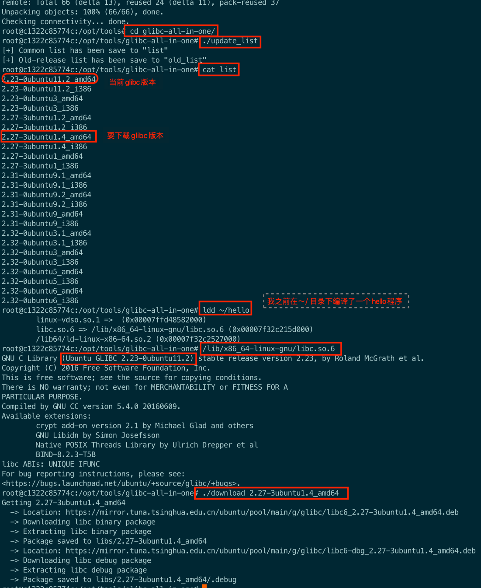
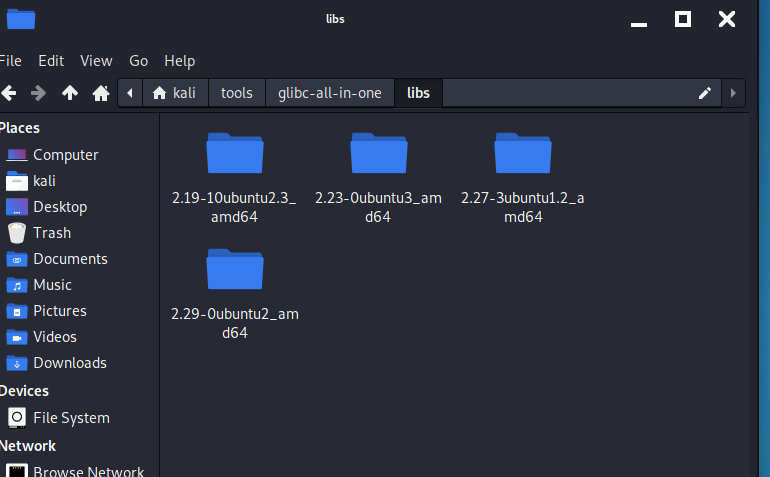
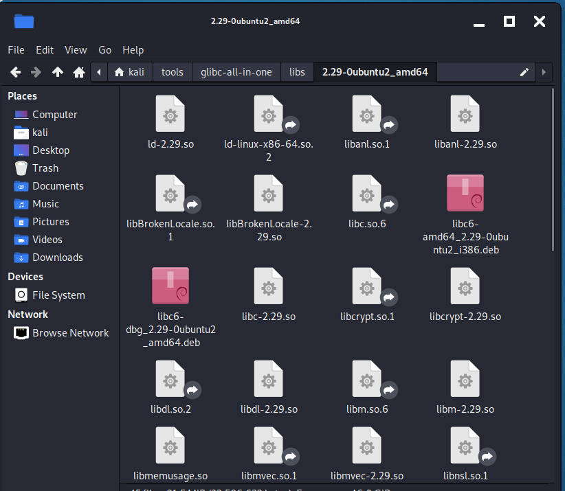
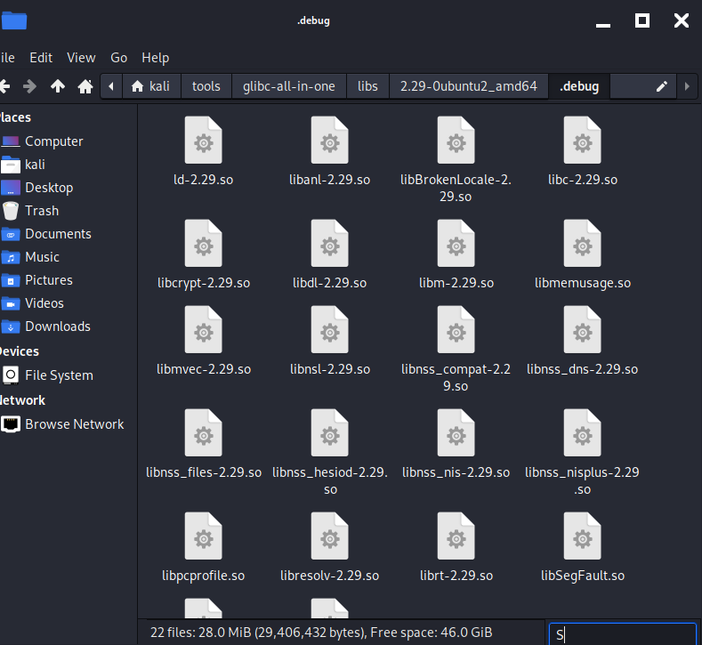
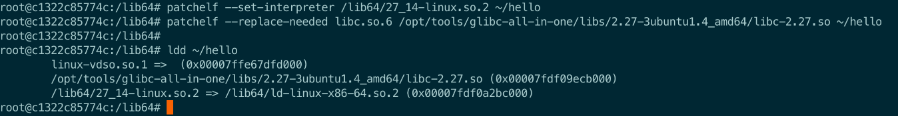

**\[原创\]关于不同版本 glibc 更换的一些问题**

*来自 \<<https://bbs.pediy.com/thread-254868.htm>\>*

# 获取不同版本的 glibc
## 安装glibc-all-in-one
<table>
<colgroup>
<col style="width: 13%" />
<col style="width: 86%" />
</colgroup>
<thead>
<tr class="header">
<th>
1

2

3

4

5

6

7

8

9

10

11

12
</th>
<th>
# 官方

git clone <a href="https://github.com/matrix1001/glibc-all-in-one.git">https://github.com/matrix1001/glibc-all-in-one.git</a>

cd glibc<strong>-</strong>all<strong>-in-</strong>one

.<strong>/</strong>update_list#更新最新版本的glibc

catlist#查看可下载的glibc

.<strong>/</strong>download glibc#glibc为你想要下载glibc的名字

ps：查看当前glibc版本号方法

<strong>/</strong>lib<strong>/</strong>x86_64<strong>-</strong>linux<strong>-</strong>gnu<strong>/</strong>libc.so.6
</th>
</tr>
</thead>
<tbody>
</tbody>
</table>

## 手动下载
通过镜像源可以下载到常见版本的 glibc 及其符号表。

通过[Ubuntu 的 old-releases 镜像站](http://old-releases.ubuntu.com/ubuntu/pool/main/g/glibc/)或者[清华的镜像站](https://mirrors.tuna.tsinghua.edu.cn/ubuntu/pool/main/g/glibc/)可以下载到不同版本的 glibc。

下载libc6_开头(之后直接跟版本号）的版本，里面有编译好的glibc，要找一找

还要下载libc6-dbg开头的对应版本，里面有符号表，要找一找，把内容复制粘贴保存到创建的./debug文件夹下

图形界面直接右键解压就行了。

命令行解压：

dpkg -X ./xxx.deb extract \# 将deb包解压到extract文件夹下

tar -I zstd -xvf xxxx.tar.zst \# I是i的大写

sudo apt install zstd \#如果没装zstd

大概这样

# 安装patchelf
#  给程序换glibc
## patchelf更改elf文件的ld和libc
<table>
<colgroup>
<col style="width: 13%" />
<col style="width: 86%" />
</colgroup>
<thead>
<tr class="header">
<th>
1

2
</th>
<th>
patchelf<strong>--</strong>set<strong>-</strong>interpreter<strong>/</strong>lib64<strong>/</strong>27_14<strong>-</strong>linux.so.2~<strong>/</strong>hello

# 第一个参数是ld.so的目录 , hello 是二进制文件
</th>
</tr>
</thead>
<tbody>
</tbody>
</table>
<table>
<colgroup>
<col style="width: 12%" />
<col style="width: 87%" />
</colgroup>
<thead>
<tr class="header">
<th>
1

2
</th>
<th>
patchelf<strong>--</strong>replace<strong>-</strong>needed libc.so.6<strong>/</strong>opt<strong>/</strong>tools<strong>/</strong>glibc<strong>-</strong>all<strong>-in-</strong>one<strong>/</strong>libs<strong>/</strong>2.27<strong>-</strong>3ubuntu1.4_amd64<strong>/</strong>libc<strong>-</strong>2.27.so ~<strong>/</strong>hello

#libc.so.6为需要替换的libc路径 第二个参数是需要加载的glibc的目录 , hello 是二进制文件
</th>
</tr>
</thead>
<tbody>
</tbody>
</table>
<table>
<colgroup>
<col style="width: 34%" />
<col style="width: 65%" />
</colgroup>
<thead>
<tr class="header">
<th>
1

2
</th>
<th>
ldd ~<strong>/</strong>hello

# 查看是否更换成功
</th>
</tr>
</thead>
<tbody>
</tbody>
</table>

*来自 \<<https://bbs.pediy.com/thread-264508.htm>\>*
## 通过 LD_LIBRARY_PATH 或者 LD_PRELOAD
因为 ld.so 和 libc.so 不匹配的原因，所以直接设置 LD_PRELOAD 可能会炸，就如下所示...
<table>
<colgroup>
<col style="width: 19%" />
<col style="width: 80%" />
</colgroup>
<thead>
<tr class="header">
<th>
1

2
</th>
<th>
$ LD_PRELOAD<strong>=</strong>.<strong>/</strong>libc.so.6.<strong>/</strong>baby_tcache

段错误 (核心已转储)
</th>
</tr>
</thead>
<tbody>
</tbody>
</table>
可以将配套的 ld 和 libc 一起使用即可实现动态加载 libc。只需将下面代码中 LD_PRELOAD 后面的 "/path/to/libc.so.6" (要加载的 libc 的路径)和第二行的 "/path/to/ld.so" (要加载的 ld 的路径)替换成相应文件的路径就行了。
<table>
<colgroup>
<col style="width: 22%" />
<col style="width: 77%" />
</colgroup>
<thead>
<tr class="header">
<th>
1

2
</th>
<th>
$ LD_PRELOAD<strong>=/</strong>path<strong>/</strong>to<strong>/</strong>libc.so.6;

$<strong>/</strong>path<strong>/</strong>to<strong>/</strong>ld.so .<strong>/</strong>test
</th>
</tr>
</thead>
<tbody>
</tbody>
</table>
或者设置 LD_LIBRARY_PATH=/path/to/ld.so也行

在 pwntools 启动程序时，可以按照下面的代码进行设置。
<table>
<colgroup>
<col style="width: 15%" />
<col style="width: 84%" />
</colgroup>
<thead>
<tr class="header">
<th>
1

2
</th>
<th>
p<strong>=</strong>process(["/path/to/ld.so","./test"],

env<strong>=</strong>{"LD_PRELOAD":"/path/to/libc.so.6"})
</th>
</tr>
</thead>
<tbody>
</tbody>
</table>

*来自 \<<https://bbs.pediy.com/thread-254868.htm>\>*
添加新的动态链接库路径

export LD_LIBRARY_PATH=/new/dir:\$LD_LIBRARY_PATH

（注：GNU系统可以自动添加在 /etc/ld.so.conf文件中来实现环境变量的设置）
*来自 \<<https://blog.csdn.net/SoaringLee_fighting/article/details/78758318>\>*

## 俺写了个脚本
| -c glibc elfname | 改glibc             |
|------------------|---------------------|
| -l               | 列出所有glibc的名字 |
| -i glibc         | 安装glibc           |

\#!/bin/bash

\#set -x

glibcall_path="/home/kali/tools/glibc-all-in-one"

if \[\[ \$# -eq 1 && \$1 = '-l' \]\]

then

echo -e "\n what you have:\n"

echo \`ls \${glibcall_path}/libs\`

echo -e "\n what you can get:\n"

cd \${glibcall_path}

cat ./list

elif \[\[ \$# -eq 1 && \$1 = '-u' \]\]

then

cd \${glibcall_path}

./update_list

elif \[\[ \$# -eq 2 && \$1 = '-i' \]\]

then

cd \${glibcall_path}

./download \$2

elif \[\[ \$# -eq 3 && \$1 = '-c' \]\]

then

libc_name=\$2

elf_path=\$3

libc_path="\${glibcall_path}/libs/\${libc_name}"

if \[ -f \${libc_path}/ld-\[2\].\[0-9\]\[0-9\].so \]; then

patchelf --set-interpreter \$libc_path/ld-\[2\].\[0-9\]\[0-9\].so \$elf_path

fi

if \[ -f \$libc_path/libc-\[2\].\[0-9\]\[0-9\].so \]; then

patchelf --replace-needed libc.so.6 \$libc_path/libc-\[2\].\[0-9\]\[0-9\].so \$elf_path

fi

else

echo -e "\nformat wrong!\n"

echo -e "you can use like that:\n"

echo -e "\tchglibc -l \t# to list glibc\n"

echo -e "\tchglibc -u \t# to update list\n"

echo -e "\tchglibc -i glibc \t# to install glibc\n"

echo -e "\tchglibc -c libc_type filename\n"

fi

\#set +x

# 在 gdb 中加载 debug 文件/符号表
如果只是直接 Patch 了 ELF 文件的 ld 和 libc，而没有放置符号表的话，那么在使用 GDB 调试的时候就不容易看到 libc 中的各种结构。所以我们需要加载符号表来方便调试。

Ubuntu 的软件维护者在编译对应的 ELF 文件时，会将符号表与 ELF 文件分离，将符号表命名为 "\*-dbg.deb"。这样我们就可以通过手动下载符号表来方便调试。

如果是使用 "glibc all in one" 下载的 libc，会在 libc 等库放置的位置使用 ".debug" 文件夹存放好了 libc 的符号表，使用 gdb 可以自动加载。但是碰到 "glibc all in one" 没有的 libc 版本时就需要手动下载 debug 文件，并手动加载了。

**将 debug 文件放入 ".debug" 文件夹**

在放置 libc 的目录下新建 ".debug"文件夹，将 debug 文件放入其中即可。原理见参考文章 2，glibc 的官方文档。

**通过 gdb 命令 set debug-file-directory directories**

在参考文章1可以看到关于 gdb 如何加载分离的 debug 文件，我们只要将 libc 等库的 debug 文件放入对应文件夹，并通过set debug-file-directory \$directories命令将文件夹设为分离的 debug 文件目录，就可以让 gdb 加载 debug 文件。

**通过 gdb python api 的 add_separate_debug_file() 加载**

gdb 的 python api 中有一个Objfile.add_separate_debug_file (file)来让对应的二进制文件加载分离的 debug file，这里我将其封装成了命令，在程序运行起来后通过修改下面的命令即可加载。

*来自 \<<https://bbs.pediy.com/thread-254868.htm>\>*
我试了！只有debug文件有用！
