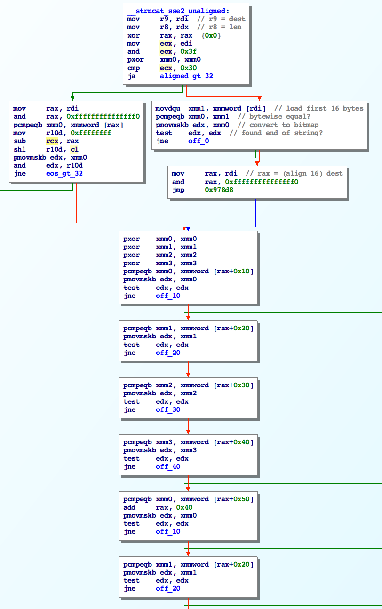
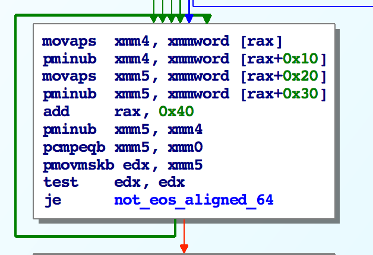
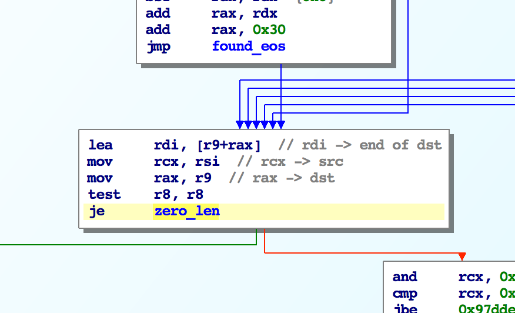
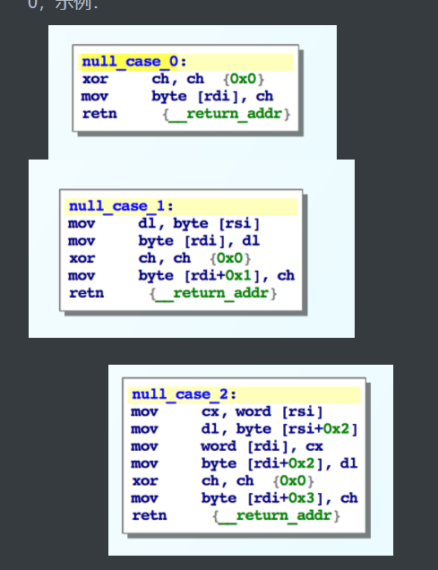
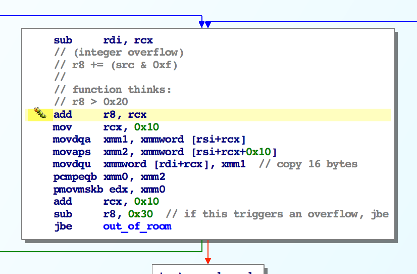
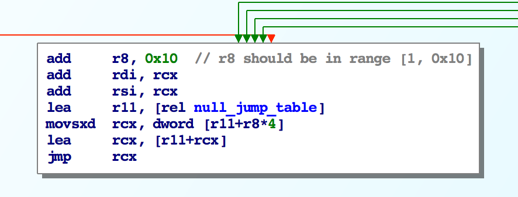
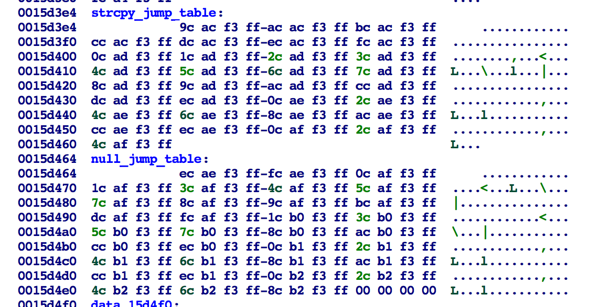

[36C3 CTF 之 flag concat \| Clang裁缝店 (xuanxuanblingbling.github.io)](https://xuanxuanblingbling.github.io/ctf/pwn/2020/01/01/strncat/)
[CTFtime.org / hxp 36C3 CTF / flag concat](https://ctftime.org/task/10201)
[hxpctf 2019 - flag concat (244pt) (harrisongreen.me)](https://ctf.harrisongreen.me/2019/hxpctf/flag_concat/)
分析
**源码**
// gcc -no-pie -o vuln vuln.c
​
\#include \<stdint.h\>
\#include \<string.h\>
\#include \<stdio.h\>
\#include \<stdlib.h\>
​
typedefstruct{
chars1\[0x400\];
chars2\[0x200\];
char\*concatenated_s3;
} packed_strings;
​
packed_stringsstrings;
​
voidwin(){
printf("Debug mode activated!\n");
system("cat flag.txt");
}
​
voiddo_strncat(){
intoutput_len=0;
char\*start_s1=NULL;
char\*start_s2=NULL;
​
printf("First Flag:\n");
fgets(strings.s1, 0x100, stdin);
printf("Second Flag:\n");
fgets(strings.s2, 0x100, stdin);
​
printf("1: %s\n",strings.s1);
printf("2: %s\n",strings.s2);
​
output_len=strlen(strings.s1) +strlen(strings.s2);
chars3\[output_len+1\];
strings.concatenated_s3=s3;
​
printf("Going to output %i bytes max!\n", output_len);
​
start_s1=strstr(strings.s1, "hxp{");
start_s2=strstr(strings.s2, "hxp{");
​
printf("3: %s\n",strings.s1);
printf("4: %s\n",strings.s2);
​
if(!start_s1){
start_s1=strings.s1;
}
if(!start_s2){
start_s2=strings.s2;
}
​
printf("5: %s\n",strings.s1);
printf("6: %s\n",strings.s2);
​
strncat(start_s1, start_s2, SIZE_MAX);
printf("7: %s\n",strings.s1);
printf("8: %s\n",strings.s2);
strcpy(strings.concatenated_s3, start_s1);
​
printf("%s\n", strings.concatenated_s3);
}
​
intmain(){
setbuf(stdout, NULL);
setbuf(stdin, NULL);
printf("Welcome to the hxp flag concat protocol server!\n");
do_strncat();
return0;
}
​
**保护**

**执行**
Welcome to the hxp flag concat protocol server!
First Flag:
flag1
Second Flag:
flag2
Going to output 12 bytes max!
flag1
flag2
**反编译**
bss:00000000006010A0         public strings
.bss:00000000006010A0 ; char strings\[1024\]
.bss:00000000006010A0 strings     db 400h dup(?)     ; DATA XREF: do_strncat+49↑o
.bss:00000000006010A0                     ; do_strncat+7C↑o ...
.bss:00000000006014A0 ; char haystack\[512\]
.bss:00000000006014A0 haystack    db 200h dup(?)     ; DATA XREF: do_strncat+70↑o
.bss:00000000006014A0                     ; do_strncat+8B↑o ...
.bss:00000000006016A0 ; char \*dest
.bss:00000000006016A0 dest      dq ?        
intdo_strncat()
{
intlen2; // eax
intoutsize; // eax
void\*concatstr; // rsp
\_BYTEoverflow\[12\]; // \[rsp+0h\] \[rbp-70h\] BYREF
intlen1; // \[rsp+Ch\] \[rbp-64h\]
\_BYTE\*v6; // \[rsp+18h\] \[rbp-58h\]
\_\_int64outlen2; // \[rsp+20h\] \[rbp-50h\]
unsignedintoutlen; // \[rsp+2Ch\] \[rbp-44h\]
char\*src; // \[rsp+30h\] \[rbp-40h\]
char\*dest; // \[rsp+38h\] \[rbp-38h\]
​
outlen=0;
dest=0LL;
src=0LL;
puts("First Flag:");
fgets(strings, 256, stdin);
puts("Second Flag:");
fgets(haystack, 256, stdin);
len1=strlen(strings);
len2=strlen(haystack);
outlen=len1+len2;
outsize=len1+len2+1;
outlen2=outsize-1LL;
concatstr=alloca(16\*((outsize+15LL) /0x10uLL));
v6=overflow;
::dest=overflow;
printf("Going to output %i bytes max!\n", outlen);
dest=strstr(strings, "hxp{");
src=strstr(haystack, "hxp{");
if( !dest)
 dest=strings;
if( !src)
 src=haystack;
strncat(dest, src, 0xFFFFFFFFFFFFFFFFLL);
strcpy(::dest, dest);
returnputs(::dest);
}
**strncat**
**查找第一个空字节**
一两句说不清楚

- **PCMPEQB**：执行SIMD比较目的操作数(第一个操作数)和源操作数(第二个操作数)中的打包字节、字或双字是否相等。如果一对数据元素相等，则目标操作数中对应的数据元素全部设为1;否则，全为0。
- **PMOVMSKB**： 创建由源操作数（第二个操作数）每个字节的最高有效位组成的掩码，并将结果存储在目标操作数（第一个操作数）的低位字节或字中。64位源操作数的字节掩码为8位，128位源操作数的字节掩码为16位，256位源操作数的字节掩码为32位。目标操作数是一个通用寄存器。
- 概括的说，每次提取0x10字节的字符串，判断和xmm（已清0）是否相等，如果有哪个字节相等（也就是为空字节），那么xmm对应的字节会变成全1，然后pmovmskb生成的bitmap就不会等于0，test就not equal，就找到了。  
  pcmpeqb xmm2, xmmword \[rax+0x30\]  
  pmovmskb edx, xmm2  
  test  edx, edx  
  jne   off_30
64字节对齐的高效代码

- **PMINUB**：执行SIMD比较第二源操作数和第一源操作数的Packed Unsigned字节或Word整数，并返回到目标操作数的每对整数的最小值。
找到NULL

**拷贝**
拷贝剩下的字节（小于32位）
之前的字节会16字节对齐地拷贝到dest？最后会剩下一些字节，总数小于32位。这些字节的处理方式有两种。
- strcpy_jump_table\[i\]:拷贝i+1字节，从src到dst。当src太大，dst装不下会用到它。
- null_jump_table\[i\]:拷贝i字节，从src到dst，并在i+1处补充0，示例：

对齐检查

复制的第一部分会执行一些对齐检查。在进入块的时候，r8等于剩下要写的字节数（由len不停减少得来），rcx 等于 src & 0xf。这一步是计算剩下要复制的长度（len+对齐填充数），如果减去0x30小于0，就跳转到最后拷贝那一步。这里程序假设r8大于0x20。
为何要减去0x30？

r8=0x21呢？假如一开始len就小于0x20呢？
但是，如果src没有0x10对齐（也就是rcx不等于0），且r8是个很大的数（这道题等于MAX_LENGTH=-1），那么r8在加上rcx后会溢出成一个很小的数。
跳转到null_jump_table

上面的程序之后会跳转到这，但因为r8变成很小的数，这里再加0x10会等于一个负数。因为strcpy_jump_table紧挨着null_jump_table，所以这里就跳转到strcpy_jump_table执行了。
在运行这步之前还会复制一次0x20字节吧？因为r8大于0x20小于0x30，这一步是复制r8-0x20之后的小于0x10的一些字节。

利用
**fuzz**
