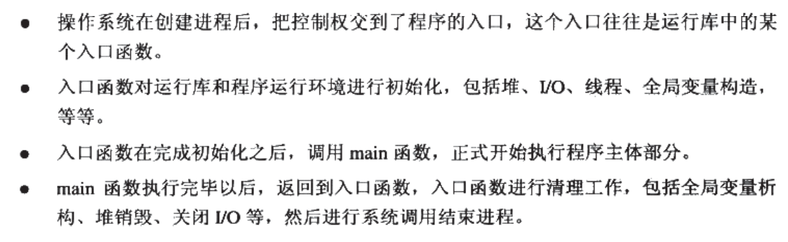
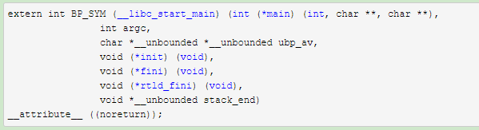

静态的glibc和动态的glibc，可执行文件和共享库，这两个排列组合的四种程序的启动过程差别很大。这里说的是可执行文件的。

# 源码阅读
可以从GNU 源码ftp站点( <http://ftp.gnu.org/gnu/libc/> )上找到

（ csu是啥意思？[What does CSU in glibc stand for](https://stackoverflow.com/questions/32725541/what-does-csu-in-glibc-stand-for)，即 “C start up”）
- \_\_libc_start_main函数可以在glibc源码的csu/libc-start.c中找到 [glibc/csu/libc-start.c](https://github.com/lattera/glibc/blob/895ef79e04a953cac1493863bcae29ad85657ee1/csu/libc-start.c)
- \_\_libc_csu_init，\_\_libc_csu_fini函数可以在glibc源码的csu/elf-init.c中找到：[glibc/csu/elf-init.c](https://github.com/lattera/glibc/blob/895ef79e04a953cac1493863bcae29ad85657ee1/csu/elf-init.c)
- \_start函数可以在glibc源码的sysdeps/i386/elf/start.S中找到：
- \_init，\_fini函数可以在glibc源码的sysdeps/generic/initfini.c中找到：

(

但是为什么不能在libc.so.6中找到_start，\_init，\_fini这三个函数呢？

是因为GNU把这三个作为了程序启动和结束的最基本运行库函数，分别放在crt1.o，crti.o，crtn.o这三个object文件中供程序链接时使用。

)

*来自 \<<https://blog.csdn.net/gary_ygl/article/details/8506007>\>*

## 运行start前内核做了什么
1.  Shell调用内核的带argc/argv参数的系统调用"execve"。
2.  内核的系统调用句柄开始处理这个系统调用。在内核代码中，这个句柄为"sys_execve".在x86机器上，用户模式的应用会通过以下寄存器将所有需要的参数传递到内核中。
    - ebx:执行程序名字的字符串
    - ecx:argv数组指针
    - edx:环境变量数组指针
3.  通用的execve内核系统调用句柄——也就是do_execve——被调用。它所做的是建立一个数据结构，将所有用户空间数据拷贝到内核空间，最后调用search_binary_handler()。Linux能够同时支持多种可执行文件格式，例如a.out和ELF。对于这个功能，存在一个数据结构"struct linux_binfmt",对于每个二进制格式的加载器在这个数据结构都会有一个函数指针。search_binary_handler()会找到一个合适的句柄并且调用它。在我们的例子中，这个合适的句柄是load_elf_binary()。解释函数的每个细节是非常乏味的工作。所以我在这里就不这么做了。如果你感兴趣，阅读相关的书籍即可。接下来是函数的结尾部分，首先为文件操作建立内核数据结构，来读入ELF映像。然后它建立另一个内核数据结构，这个数据结构包含：代码容量，数据段开始处，堆栈段开始处，等等。然后为这个进程分配用户模式页，将argv和环境变量拷贝到分配的页面地址上。最后，argc和argv指针，环境变量数组指针通过create_elf_tables()被push到用户模式堆栈中,使用start_thread()让进程开始执行起来。

*来自 \<<https://www.cnblogs.com/harlanc/p/7774882.html>\>*

## \_start
## libc_start_main

64位 rax(系统调用号), rdi(main), rsi, rdx, rcx, r8, r9
*来自 \<<https://www.cnblogs.com/harlanc/p/7774882.html>\>*
### 解说1
### 解说2

if (\_\_builtin_expect (rtld_fini != NULL, 1))

\_\_cxa_atexit ((void (\*) (void \*)) rtld_fini, NULL, NULL);

\_\_libc_init_first (argc, argv, \_\_environ);

if (fini)

\_\_cxa_atexit ((void (\*) (void \*)) fini, NULL, NULL);

if (init)

(\*init) (argc, argv, \_\_environ MAIN_AUXVEC_PARAM);

result = main (argc, argv, \_\_environ MAIN_AUXVEC_PARAM);

exit (result);

## \_\_libc_csu_init，\_\_libc_csu_fini
## \_init, \_fini
crti.o，crtn.o分别包含.init和.fini段的开头和结束部分

最终程序的_init,\_fini函数由其它库或用户自定义的.init和.fini段代码和上面的部分拼接而成

为了让程序正常运行和结束，链接器ld帮我们做了好多事情，可以用下面来表示：

ld crt1.o crti.o \[usr object\] \[lib\] crtn.o

（所以运行时libc_cus_init是合并的init还是_init是？）
### 自己编写init和fini函数
### glibc的init和fini
### 合并后的init和fini例子
## \_dl_fini
## rtld_fini
## exit
###  \_\_cxa_atexit先后？
### 
### exit
### hlt
如果main函数内部调用了exit，就不会执行fini那些函数

# 执行顺序

\_start -\> \_\_libc_start_main -\>\_\_libc_csu_init-\> \_init -\> main -\> \_fini.
*来自 \<<https://blog.csdn.net/gary_ygl/article/details/8506007>\>*
**
更细致的说顺序如下：
- .init
- .init_array\[0\]
- .init_array\[1\]
- …
- .init_array\[n\]
- main
- .fini_array\[n\]
- …
- .fini_array\[1\]
- .fini_array\[0\]
- .fini

在IDA的 view -\> open subviews -\> segments可以看到如下四个段：
- .init
- .init_array
- .fini
- .fini_array

*来自 \<<https://xuanxuanblingbling.github.io/ctf/pwn/2019/09/06/317/>\>*

浅析 main 之前代码

*来自 \<<https://blog.csdn.net/huanongying131/article/details/77714257>\>*
**
