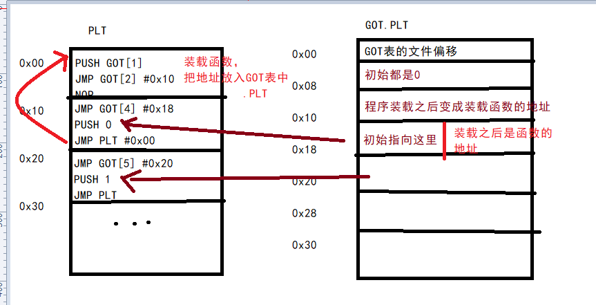

# GOT和PLT

图中GOT\[2\]是_dl_runtime_resolve

## 跟踪测试
# 结构体
## dynamic表
Elf32_Dyn

类型

查看dynamic表： readelf -d filename
## 重定位表 .rel.plt
Elf32_Rel

查看重定位表： readelf -r filename
## 符号表.dynsym节
Elf32_Sym

查看符号表：readelf -s filename
## 字符串表 .dynstr （就是纯字符串表）
# dl_resolve
## call plt\[\] -\> jmp got\[\] -\> push 函数序号; jmp plt -\> push got\[1\]; jmp got\[2\]
## got\[2\]是_dl_runtime_resolve，调用了_dl_fixup(eax = got\[1\], edx = 函数序号)
## \_dl_fixup (struct link_map \*l, ElfW(Word) reloc_arg)
<https://code.woboq.org/userspace/glibc/elf/dl-runtime.c.html#59>
1.  程序先从第一个参数link_map获取字符串表.dynstr、符号表.dynsym以及重定位表.rel.plt的地址，
2.  通过第二个参数n即.rel.plt表中的偏移reloc_arg加上.rel.plt的地址获取函数对应的重定位结构的位置，从而获取函数对应的r_offset以及在符号表中的下标r_info\>\>8。
3.  根据符号表地址以及下标获取符号结构体，获得了函数符号表中的st_name，即函数名相对于字符串表.dynstr的偏移。
4.  最后可得到函数名的字符串，然后去libc中匹配函数名，找到相应的函数并将地址填回到r_offset即函数got表中，延迟绑定完成。
[ret2dl_resolve解析 « 平凡路上 (ray-cp.github.io)](https://ray-cp.github.io/archivers/ret2dl_resolve_analysis#%E5%BB%B6%E8%BF%9F%E7%BB%91%E5%AE%9A%E6%8A%80%E6%9C%AF)

