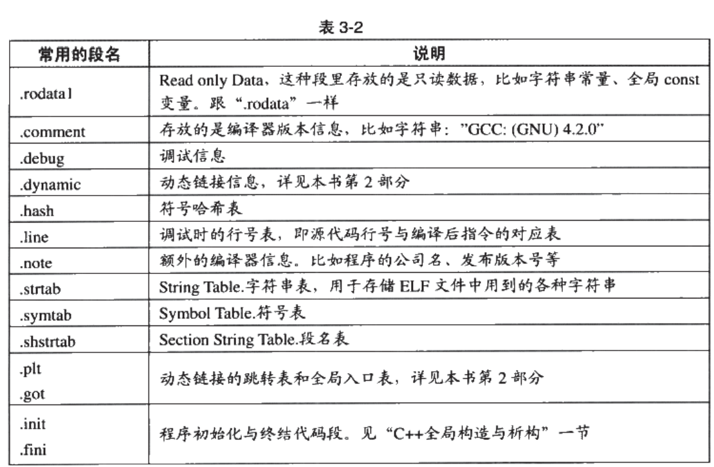
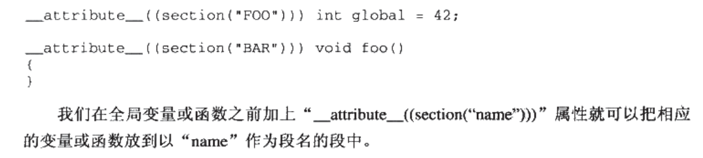

查看段
查看段信息

objdump -h simple.o

查看段大小

size simple.o

查看代码段

objdump -s -d simple.o

-s 以16进制打印 -d的把代码段反汇编

ida shift f7
# 常见段
.data 已经初始化的静态变量

.rodata 只读变量

.bss 未初始化的静态变量

自定义段

文件头
readelf -h simple.o

定义在/usr/include/elf.h

elf成员结构（32位）
段表
查看所有段：

readelf -S Simple.o

