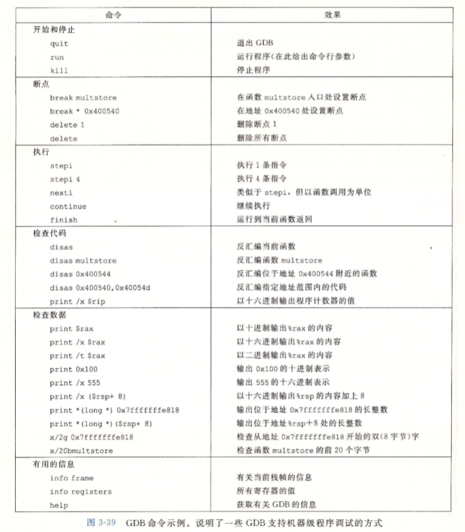

《100个gdb小技巧》

*来自 \<<https://www.kancloud.cn/wizardforcel/gdb-tips-100/146708>\>*
apropos指令查看帮助

缩写
其中许多常用命令只使用第一个字母就可以，比如：

b -\> break  
c -\> continue  
d -\> delete  
f -\> frame  
i -\> info  
j -\> jump  
l -\> list  
n -\> next  
p -\> print  
r -\> run  
s -\> step  
u -\> until

也有使用两个或几个字母的，比如：

aw -\> awatch  
bt -\> backtrace  
dir -\> directory  
disas -\> disassemble  
fin -\> finish  
ig -\> ignore  
ni -\> nexti  
rw -\> rwatch  
si -\> stepi  
tb -\> tbreak  
wa -\> watch  
win -\> winheight

另外，如果直接按回车键，会重复执行上一次的命令。

*来自 \<<https://www.kancloud.cn/wizardforcel/gdb-tips-100/146818>\>*

