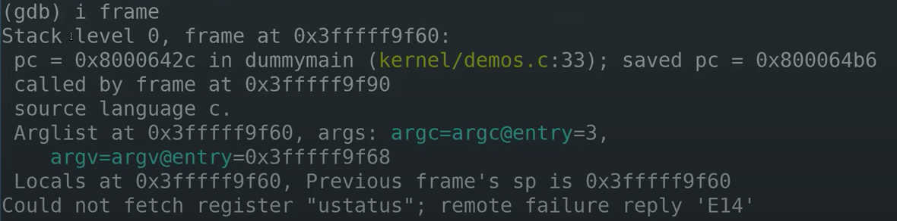

都没法编译一整个函数，可以自己添加函数地址
set \$my_addr_name=\$pc
gdb自带
layout asm

tui enable可以打开源代码展示窗口。

顺着一路反汇编

[Show current assembly instruction in GDB - Stack Overflow](https://stackoverflow.com/questions/1902901/show-current-assembly-instruction-in-gdb)

layout：用于分割窗口，可以一边查看代码，一边测试。主要有以下几种用法：

layout src：显示源代码窗口

layout asm：显示汇编窗口

layout regs：显示源代码/汇编和寄存器窗口

layout split：显示源代码和汇编窗口 或者layout source

layout next：显示下一个layout

layout prev：显示上一个layout

Ctrl + L：刷新窗口

Ctrl + x，再按1：单窗口模式，显示一个窗口

Ctrl + x，再按2：双窗口模式，显示两个窗口

Ctrl + x，再按a：回到传统模式，即退出layout，回到执行layout之前的调试窗口。

focus 窗口

x/i 0xdeadbeef
*来自 \<<https://stackoverflow.com/questions/1237489/how-to-disassemble-a-memory-range-with-gdb>\>*
**
disas STARTADDRESS ENDADDRESS

**disassemble**

**disassemble**\[*Function*\]

**disassemble**\[*Address*\]

**disassemble**\[*Start*\],\[*End*\]

**disassemble**\[*Function*\],+\[*Length*\]

**disassemble**\[*Address*\],+\[*Length*\]

**disassemble**/m \[*...*\]

**disassemble**/r \[*...*\]

*来自 \<<https://visualgdb.com/gdbreference/commands/disassemble>\>*

查看栈帧

i(nfo) frame

- Stack level 0，表明这是调用栈的最底层
- pc，当前的程序计数器
- saved pc，demo4的位置，表明当前函数要返回的位置
- source language c，表明这是C代码
- Arglist at，表明参数的起始地址。当前的参数都在寄存器中，可以看到argc=3，argv是一个地址

backtrace（简写bt）可以看到从当前调用栈开始的所有栈帧

frame 3（查看特定栈帧）

pwndbg
u

模拟分支反汇编

[u - pwndbg docs (browserpwndbg.readthedocs.io)](https://browserpwndbg.readthedocs.io/en/docs/commands/windbg/u/#command-u)

