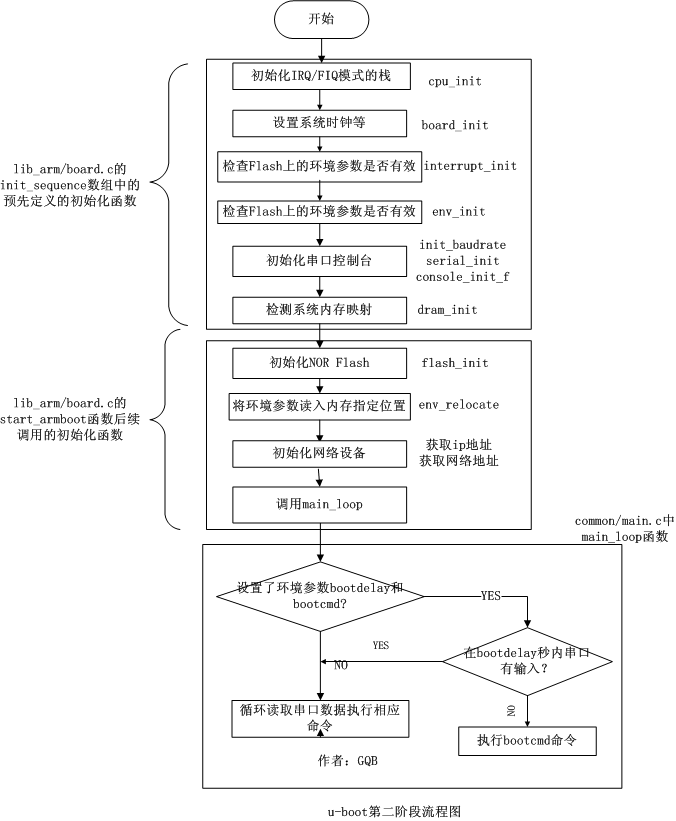

[zhaojh329/U-boot-1: U-boot学习笔记 (github.com)](https://github.com/zhaojh329/U-boot-1)

uboot是启动linux内核前的引导，为内核启动提供参数。uboot阶段，其对整个系统可以进行完整的控制。故如果可以在uboot阶段拿到控制权，即uboot的shell，则可以有非常多的办法绕过之后启动的linux的权限认证。

**因为串口是没有禁止输入的，而且uboot是可以被中断的，故完全可以使用uboot绕过密码。那如何进入uboot的shell呢？在板子上按reset重启，然后串口工具中快速按回车进入uboot命令行，可以使用help命令列出uboot的功能：**

*来自 \<<https://xuanxuanblingbling.github.io/iot/2020/11/17/iot/>\>*

cpu首先执行位于0地址的uboot，uboot启动以后初始化一些资源，告诉内核有关的参数并引导内核，内核通过事先添加对于某种文件系统类型的支持驱动（相当于一小段程序），读取uboot等boot loader在指定的区域烧写制作好的文件系统镜像，内核解析并挂载成根文件系统，并在此基础上，通过VFS（虚拟文件系统）再挂载不同的文件系统类型，完成启动以后，再去管理有关的资源（包括应用程序）

*来自 \<<https://www.cnblogs.com/schips/p/13129047.html>\>*

# 启动流程
[U-Boot启动过程完全分析 - 苍梧 - 博客园 (cnblogs.com)](https://www.cnblogs.com/heaad/archive/2010/07/17/1779829.html)

[超详细分析Bootloader（Uboot）到内核的启动流程（万字长文！） - 云+社区 - 腾讯云 (tencent.com)](https://cloud.tencent.com/developer/article/1826711)
## 第一阶段 从_start开始，硬件的初始化，布置内存区域，装载uboot到内存
## 第二阶段 各种初始化，串口控制台，进入main_loop 等一会自动启动内核

使用bootm命令启动内核，大概就是使用tag传递参数？得到环境变量bootargs，找到内核入口地址，跳转

