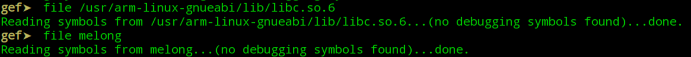

# ssh访问虚拟机
开启 ssh 服务，并设置开机启动

sudo service ssh start  
sudo update-rc.d ssh enable

打开ssh？

ssh pi@127.0.0.1 -p 5022

scp传递文件

scp -P 5022 \*.\* pi@127.0.0.1:/tmp

传输文件夹

scp-r squashfs-root/ root@192.168.231.2:\~/

# 安装gdb-multiarch
于默认安装的 gdb 只支持 x86/x64 架构（可以启动 gdb 然后输入命令set architecture arm查看），而gdb-multiarch 是 gdb 支持多种硬件体系架构的版本，安装指令如下：

//安装gdb-multiarch

sudo apt install gdb-multiarch

//启动gdb-multiarch

gdb-multiarch
# 编译gdbserver
有些系统可能没有gdb，需要自己下载[对应版本源码](https://ftp.gnu.org/gnu/gdb/)并编译相应版本的gdbserver：

//安装交叉编译环境  
\$ apt install gcc-5-arm-linux-gnueabi gcc-5-arm-linux-gnueabihf  
//下载解压后进入\`gdb-\<version\>/gdb/gdbserver\`目录  
\$ CC="arm-linux-gnueabi-gcc-5" CXX="arm-linux-gnueabi-g++-5" ./configure --target=arm-linux-gnueabi --host="arm-linux-gnueabi"  
\$ make install  
\$ file arm-linux-gnueabi-gdbserver  
arm-linux-gnueabi-gdbserver: ELF 32-bit LSB executable, ARM, EABI5 version 1 (SYSV), dynamically linked, interpreter /lib/ld-linux.so.3, for GNU/Linux 3.2.0,  
BuildID\[sha1\]=32ad2025951ee428276ac2fbadb199bfd39e2278, not stripped

各种指令集的静态编译的gdbserver已经上传到百度网盘: <https://pan.baidu.com/s/1_Grqzwyf3NOesbWLp6gBKg> 密码:hfab
# 传输gdbserver到系统中，并启动
//pc端

\$ scp -P 5022 arm-linux-gnueabi-gdbserver pi@127.0.0.1:/tmp/

//树莓派端

\$ ln -s arm-linux-gnueabi-gdbserver gdbserver

\$ gdbserver 0.0.0.0:2333 \*

Process hello created; pid = 702

Listening on port 2333

//tp-link

./gdbserver-7.7.1-armhf-eabi5-v1-sysv :1234 /usr/bin/tddp

//第二种：使用gdbserver的--attach选项，根据pid附加到已经启动的进程，会断在程序当前运行的状态处

/ \# /usr/bin/tddp &

/ \# \[tddp_taskEntry():151\] tddp task start

/ \# ps \| grep tddp

2457 root 1352 S /usr/bin/tddp

2459 root 1324 S grep tddp

/ \# ./gdbserver-7.7.1-armhf-eabi5-v1-sysv :1234 --attach 2457

Attached; pid = 2457

Listening on port 1234

Remote debugging from host 1.1.1.1

# gdb remote连接gdbserver
## gef
//建议先安装 gdb 增强脚本gef

\$ wget -q -O- <https://github.com/hugsy/gef/raw/master/scripts/gef.sh> \| sh

//设置目标硬件体系架构为 arm

gef\> set architecture arm

//使用 gef-remote 命令连接 gdbserver，如果使用 gdb 自带的“ target remote ”命令会出现一些\[非预期的问题\]( <https://github.com/hugsy/gef/issues/7> )

gef\> gef-remote –q 127.0.0.1:2333

## pwndbg
gdb-multiarch -q ./typo \# -q --quiet Do not print version number on startup.

// 进入pwndbg后

set architecture arm

set endian little

target remote :1234
## 可以用 -ex "命令" 提前运行命令！
# gdb远程调试的问题
此处需要注意，在远程调试下会发现有一部分命令很难用，比如s/n这两个指令，当然官网也给出了不可用的原因是：

s 相当于其它调试器中的“Step Into (单步跟踪进入)”

n 相当于其它调试器中的“Step Over (单步跟踪)”

**这两个命令必须在有源代码调试信息的情况下才可以使用（GCC编译时使用“-g”参数）。**

而我们可以发现，无论是源程序还是libc都是没有调试信息的。

因此我们需要使用si/ni指令来替代它们。

*来自 \<<https://www.anquanke.com/post/id/199112>\>*

