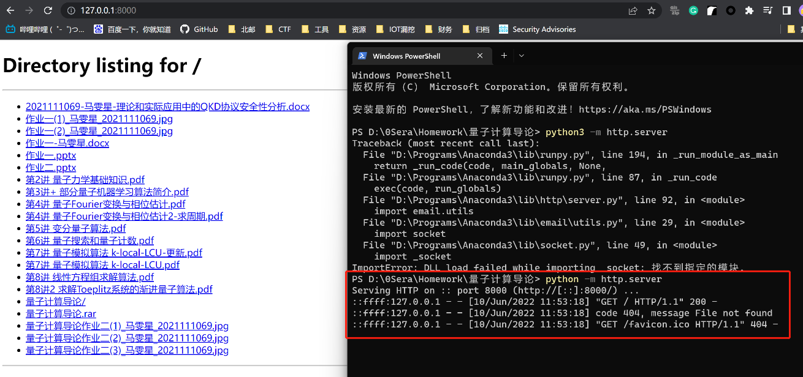

[Qemu虚拟机与宿主机之间文件传输 \| BruceFan's Blog (pwn4.fun)](http://pwn4.fun/2020/05/27/Qemu%E8%99%9A%E6%8B%9F%E6%9C%BA%E4%B8%8E%E5%AE%BF%E4%B8%BB%E6%9C%BA%E4%B9%8B%E9%97%B4%E6%96%87%E4%BB%B6%E4%BC%A0%E8%BE%93/)

# 挂载硬盘法
## 主机挂硬盘传文件
1.  用dd创建一个文件，作为虚拟机和宿主机之间传输桥梁
dd if=/dev/zero of=\$PWD/share.img bs=1M count=500

bs：一次读入/输出的块大小

count：拷贝块的个数

上述例子中最大可以传输的文件大小为500M。
2.  格式化share.img文件
mkfs.ext4 \$PWD/share.img
3.  在宿主机上创建一个文件夹
<table>
<colgroup>
<col style="width: 100%" />
</colgroup>
<thead>
<tr class="header">
<th>
mkdir /tmp/share

sudo mount -o loop $PWD/share.img /tmp/share
</th>
</tr>
</thead>
<tbody>
</tbody>
</table>
现在把宿主机上需要传输给虚拟机的文件放到/tmp/share下即可。
## 虚拟机挂硬盘
1.  启动Qemu虚拟机，额外为虚拟机添加一块硬盘
-drive file=\$PWD/share.img,if=virtio
2.  在虚拟机中mount上刚添加的硬盘，即可获得宿主机上放在/tmp/share文件夹下的文件。具体做法是：通过dmesg的输出找到新挂载的硬盘，然后将硬盘mount上来。
mount -t ext4 /dev/vda /mnt/
# 网络传输法
在指定目录下执行 直接就是个文件服务器

python3 -m http.server 8080

wget即可
