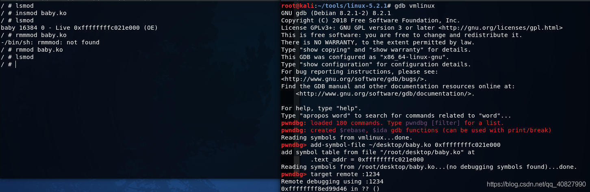

# qume

qemu-system-x86_64 \\

-kernel \~/tools/linux-5.2.1/arch/x86_64/boot/bzImage \\

-initrd \~/tools/busybox-1.31.0/rootfs.img \\

-append "console=ttyS0 root=/dev/ram rdinit=/sbin/init" \\

-cpu kvm64,+smep,+smap \\

-nographic \\

-gdb tcp::1234 \\

-m 2G \\

-S -netdev user,id=t0, -device e1000,netdev=t0,id=nic0

不懂的命令可以直接搜：

qemu-system-x86_64 -h \| grep gdb

<table>
<colgroup>
<col style="width: 55%" />
<col style="width: 44%" />
</colgroup>
<thead>
<tr class="header">
<th>-kernel</th>
<th>
设置内核bzImage文件的路径。

vmlinux: 未压缩的ELF格式的linux内核，可以使用<a href="https://github.com/torvalds/linux/blob/master/scripts/extract-vmlinux">extract-vmlinux</a>解压bzImage得到
</th>
</tr>
</thead>
<tbody>
<tr class="odd">
<td>-initrd</td>
<td>设置刚才利用busybox创建的rootfs.img，作为内核启动的文件系统（设置为初始的ram磁盘）</td>
</tr>
<tr class="even">
<td>
-drive file=./rootfs.img \

-append "console=ttyS0 root=/dev/sda earlyprintk=serial nokaslr" \
</td>
<td>
也可以用这个方式装载文件系统

nokaslr 关闭随机偏移，调试时要关闭，否则无法下断点
</td>
</tr>
<tr class="odd">
<td>-gdb tcp::1234</td>
<td>设置gdb的调试端口为1234 (可以简写成 -s)</td>
</tr>
<tr class="even">
<td>-nographic</td>
<td>
取消图形输出窗口；

和-append "console=ttyS0"结合使用可以关闭弹窗
</td>
</tr>
<tr class="odd">
<td>-append "console=ttyS0 root=/dev/ram rdinit=/sbin/init"</td>
<td>
append 为kernel指定启动参数。

将输出重定向到console，将会显示在标准输出stdio。

root=/dev/ram 定位文件系统

rdinit=/sbin/init 定位初始化进程？
</td>
</tr>
<tr class="even">
<td>以下可选</td>
<td></td>
</tr>
<tr class="odd">
<td>-monitor /dev/null</td>
<td>对 qemu 提供的控制台进行重定向，如果没有设置的话，可以直接进入控制台</td>
</tr>
<tr class="even">
<td>-cpu kvm64,+smep,+smap</td>
<td>
指定指定要模拟的处理器架构，可以同时开启一些保护，这里开启了smap和smep

SMEP（Supervisor Mode Execution Protection 管理模式执行保护）：禁止CPU处于 ring0 模式时执行用户空间代码。

SMAP（Superivisor Mode Access Protection 管理模式访问保护）：禁止内核CPU访问用户空间的数据。

</td>
</tr>
<tr class="odd">
<td>-m</td>
<td>指定内存大小。</td>
</tr>
<tr class="even">
<td>-S</td>
<td>-S freeze CPU at startup (use 'c' to start execution)</td>
</tr>
<tr class="odd">
<td>
-smp cores=2,threads=1

-smp [cpus=]n[,cores=cores][,threads=threads][,dies=dies][,sockets=sockets][,maxcpus=maxcpus]
</td>
<td>指定使用到的核数。</td>
</tr>
<tr class="even">
<td>-netdev user,id=t0,</td>
<td>
-netdev user,id=str[,ipv4=on|off][,net=addr[/mask]][,host=addr]

[,ipv6=on|off][,ipv6-net=addr[/int]][,ipv6-host=addr]

[,restrict=on|off][,hostname=host][,dhcpstart=addr]

[,dns=addr][,ipv6-dns=addr][,dnssearch=domain][,domainname=domain]

[,tftp=dir][,tftp-server-name=name][,bootfile=f][,hostfwd=rule][,guestfwd=rule][,smb=dir[,smbserver=addr]]

configure a user mode network backend with ID 'str',

its DHCP server and optional services
</td>
</tr>
<tr class="odd">
<td>-device e1000,netdev=t0,id=nic0</td>
<td>
-device driver[,prop[=value][,...]]

add device (based on driver)

use '-device help' to print all possible drivers

use '-device driver,help' to print all possible properties
</td>
</tr>
<tr class="even">
<td>-no-reboot</td>
<td></td>
</tr>
<tr class="odd">
<td>-enable-kvm</td>
<td></td>
</tr>
</tbody>
</table>

# 虚拟机不支持虚拟化

运行qemu KVM 报错，其报错信息如下所示：

Could not access KVM kernel module: No such file or directory  
qemu-system-x86_64: failed to initialize kvm: No such file or directory

使用以下命令查看当前 linux in vmware 支不支持虚拟化，发现输出为空，即**不支持**。

egrep '^flags.\*(vmx\|svm)' /proc/cpuinfo

## WSL2开启kvm
[WSL2 开启 KVM \| Lantern's 小站](https://lantern.cool/tool-wsl2-kvm/)

## vmware开去kvm
检查了一下物理机的 Virtualization Settings, 已经全部是打开了的。再检查以下 VMware 的CPU配置，发现没有勾选虚拟化 Intel VT-x/EPT 或 AMD-V/RVI。

勾选后重新启动 linux 虚拟机，提示此平台不支持虚拟化的 Intel VT-x/EPT……

经过一番百度，发现是 Hyper-V 没有禁用彻底。彻底禁用的操作如下：
- 控制面板—程序——打开或关闭Windows功能，取消勾选Hyper-V，确定禁用Hyper-V服务
- **管理员权限**打开 cmd，执行bcdedit /set hypervisorlaunchtype off  
  若想重新启用，则执行bcdedit /set hypervisorlaunchtype auto
- 重启计算机
之后再启动 linux in Vmware，其内部的 kvm 便可以正常执行了。

*来自 \<<https://www.anquanke.com/post/id/255883>\>*

# gdb
set architecture i386:x86-64

add-symbol-file vmlinux

gef-remote --qemu-mode localhost:1234

b start_kernel

c

同时我们为了调试内核模块，利用add-symbol-file命令加载了驱动的符号文件,并且加上了系统里面驱动的加载基地址…

*来自 \<<https://blog.csdn.net/qq_40827990/article/details/97036109>\>*

# 例子
新手向———内核调试（上）

*来自 \<<https://www.anquanke.com/post/id/176492>\>*

[Kernel PWN 环境搭建 - cj的小站 (cjovi.icu)](https://www.cjovi.icu/pwnreview/1318.html)

[Linux 内核漏洞利用教程（一）：环境配置](https://www.anquanke.com/post/id/85837)

[Linux 内核漏洞利用教程（二）：两个Demo](https://www.anquanke.com/post/id/85840)

*来自 \<<http://p4nda.top/2018/04/04/kernel-pwn-start/>\>*

*来自 \<<https://www.v4ler1an.com/2020/12/qemu/>\>*
**
**
