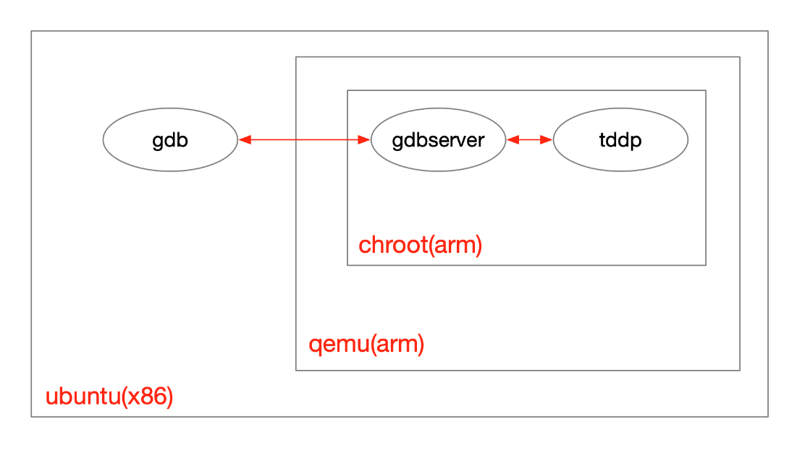

# qemu
qemu-system-arm \\

-kernel ./kernel \\

-dtb ./kernel.dtb \\

-cpu arm1176 \\

-m 256 \\

-M versatilepb \\

-serial stdio \\

-append "root=/dev/sda2 panic=1 rootfstype=ext4 rw" \\

-hda rootfs.img

<table>
<colgroup>
<col style="width: 13%" />
<col style="width: 86%" />
</colgroup>
<thead>
<tr class="header">
<th>-kernel</th>
<th>指定kernel文件。</th>
</tr>
</thead>
<tbody>
<tr class="odd">
<td>-dtb</td>
<td>指定dtb(Device Tree Blob)文件，假如kernel包含dtb。</td>
</tr>
<tr class="even">
<td>-cpu</td>
<td>指定cpu类型。(qemu-system-arm -M highbank -cpu help查看可选项,（这个可能版本有bug, 必须指定-M才能查看）)</td>
</tr>
<tr class="odd">
<td>-m</td>
<td>指定内存大小。</td>
</tr>
<tr class="even">
<td>-M</td>
<td>
制定机器类型。 (qemu-system-arm -machine help查看可选项)

virt
</td>
</tr>
<tr class="odd">
<td>-serial</td>
<td>重定向串口。</td>
</tr>
<tr class="even">
<td>-append</td>
<td>为kernel指定启动参数。</td>
</tr>
<tr class="odd">
<td>-hda</td>
<td>指定磁盘镜像。</td>
</tr>
<tr class="even">
<td>-smp</td>
<td>虚拟机可以使用的cpu核数</td>
</tr>
</tbody>
</table>

# 配置网络
[mips-pwn环境搭建 \| e3pem's Blog](https://e3pem.github.io/2019/08/23/mips-pwn/mips-pwn%E7%8E%AF%E5%A2%83%E6%90%AD%E5%BB%BA/)

创建网桥：

sudo brctl addbr br0

sudo ifconfig br0 192.168.122.1/24 up

创建tap接口，名字为tap0，并添加到网桥:

sudo tunctl -t tap0

sudo ifconfig tap0 192.168.122.11/24 up

sudo brctl addif br0 tap0

在qemu命令后加一行

-net nic -net tap,ifname=tap0,script=no,downscript=no

输入root/root进入虚拟机，设置ip：

ifconfig eth0 192.168.122.12 netmask 255.255.255.0 up
# 传文件
在指定目录下执行 直接就是个文件服务器

python3 -m http.server 8080
# 单个程序：socat+gdbserver+pwntools
\# 如果有题目自带的库

export LD_LIBRARY_PATH=\$(pwd):\$LD_LIBRARY_PATH

\# 虚拟机后台运行程序，绑定到10001端口

./socat TCP4-LISTEN:10001,fork EXEC:./main \>/dev/null 2\>&1 &

\# pwntools连接

p=remote('192.168.122.12',10001)

\# 虚拟机里ps找main的pid

\# gdbserver attach到它

./gdbserver :1234 --attach pid

\# 主机gdb连接

gdb-multiarch -q ./main -x init.gdb

\# init.gdb的脚本

set architecture aarch64

set endian little

set solib-search-path ./

target remote 192.168.122.12:1234

\# 终止gdbserver

monitor exit
# 文件系统：chroot+web服务器
使用qemu-system过程虽然有些繁琐：
1.  对于固件，要解包，拷贝调试器，可能还要修改或者patch，最后打包
2.  对于本机，要配置网卡，架设Web服务器
3.  对于qemu，要下载对应架构的执行环境，启动后要配置网卡，下载固件，挂载文件系统，最后chroot
4.  对于目标程序，要想办法正常启动起来，然后用gdb挂上
在执行环境的层次上，可以用如下图表示：

# 例子（待整理）
[\[原创\]第一个mips pwn搭建环境，逆向，调试，最终exp的过程-Pwn-看雪论坛-安全社区\|安全招聘\|bbs.pediy.com](https://bbs.pediy.com/thread-259646-1.htm)

[QEMU搭建Linux实验环境 - achievelv - 博客园 (cnblogs.com)](https://www.cnblogs.com/lvzh/p/14907592.html)

[利用Qemu-4.0虚拟ARM64实验平台 \| 点滴汇聚 (chasinglulu.github.io)](https://chasinglulu.github.io/2019/07/27/%E5%88%A9%E7%94%A8Qemu-4-0%E8%99%9A%E6%8B%9FARM64%E5%AE%9E%E9%AA%8C%E5%B9%B3%E5%8F%B0/)

[HWS夏令营 之 GDB调一切 \| Clang裁缝店 (xuanxuanblingbling.github.io)](https://xuanxuanblingbling.github.io/ctf/pwn/2020/08/24/gdb/)

[IoT（七）通过qemu调试IoT固件和程序 \~ gandalf](http://www.gandalf.site/2018/12/iotqemuiot.html#0x2%E7%94%A8%E6%88%B7%E6%A8%A1%E5%BC%8F%E8%B0%83%E8%AF%95%E7%A8%8B%E5%BA%8F)

书上的例子

