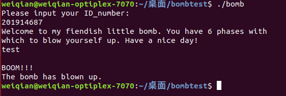

# qemu运行默认没有NX保护
# qemu-user在固定环境下基址固定
# qemu
直接运行即可：

//原来运行命令

\$ \<executable\> \<arg1\> \<arg2\> ...

//使用qemu-arm运行

\$ qemu-\[cpu架构\] \<executable\> \<arg1\> \<arg2\> ...

安装gnome-tweaks工具，可以调整字体大小，映射caps到esc键

qemu-arm -g 1234 ./file
| -g 1234                   | 开启一个1234端口的gdbserver (可以简写成 -s)                   |
|---------------------------|---------------------------------------------------------------|
| -L /usr/mipsel-linux-gnu/ | set the elf interpreter prefix to 'path' 设置动态连接库的路径 |

# gdb-multiarch
gdb-multiarch -q ./typo \# -q --quiet Do not print version number on startup.

// 进入pwndbg后

set architecture arm

set endian little

set solib-search-path ./

target remote :1234
## 
## pwntools 开gdb调试
sh = process(\["qemu-aarch64", "-g", "1234", "-L", "/usr/aarch64-linux-gnu", "./shanghai2018_baby_arm"\])

\# 在这里开一个新窗口，gdb 远程连到这个程序

log.info('Please use GDB remote!(Enter to continue)')

raw_input()

\#直接gdb.attach(sh)也可以好像！

## qemu-user的gdb限制
1.  经过测试，peda、gef、pwndbg三款插件，pwndbg对于qemu-user的gdbserver支持是最好的，另两个很多东西都看不到。
2.  可以看到这里识别embedded_heap的内存中没有libc.so.0，但是在qemu模拟的内存中，libc的确存在，需要自行在目标程序中打断，然后分析libc地址，如果采用qemu-system方法启动一整个文件系统，将不会出现这种情况。
3.  使用qemu-user模式下的自带的gdbserver，gdb调试时无法使用control+c发送SIGINT，也就无法使程序随意断下，必须通过手动下断点的方式调试程序。

*来自 \<<https://xuanxuanblingbling.github.io/ctf/pwn/2020/08/24/gdb/>\>*

# 动态连接库
## 下载标准的库
搜索可用的多架构运行库。

apt-cache search "libc6" \| grep -E "arm\|mips"

我们只需要安装形如libc6-\*-cross的运行库即可。

sudo apt-get install libc6-arm64-cross libc6-armel-cross libc6-armhf-cross libc6-mips-cross libc6-mips32-mips64-cross libc6-mips32-mips64el-cross libc6-mips64-cross libc6-mips64-mips-cross libc6-mips64-mipsel-cross libc6-mips64el-cross libc6-mipsel-cross libc6-mipsn32-mips-cross libc6-mipsn32-mips64-cross libc6-mipsn32-mips64el-cross libc6-mipsn32-mipsel-cross

*来自 \<<https://www.anquanke.com/post/id/199112>\>*

完整库列表：[【Pwn 笔记】跨平台架构的环境配置与调试 \| binLep's Blog](https://binlep.github.io/2020/03/20/%E3%80%90Pwn%20%E7%AC%94%E8%AE%B0%E3%80%91%E8%B7%A8%E5%B9%B3%E5%8F%B0%E6%9E%B6%E6%9E%84%E7%9A%84%E7%8E%AF%E5%A2%83%E9%85%8D%E7%BD%AE%E4%B8%8E%E8%B0%83%E8%AF%95/)
## 使用题目自带的库
如果带动态链接库的二进制文件，可以使用qemu-user的-L选项使用当前目录，然后动态库存放于当目录的lib子目录中：

➜ file embedded_heap

embedded_heap: ELF 32-bit MSB shared object, MIPS, MIPS32 rel2 version 1 (SYSV), dynamically linked, interpreter /lib/ld-uClibc.so.0, stripped

➜ ls \*

embedded_heap

lib:

ld-uClibc-0.9.33.2.so ld-uClibc.so.0 libc.so.0 libuClibc-0.9.33.2.so

➜ qemu-mips -L ./ ./embedded_heap

/lib/ld-uClibc.so.0: Invalid ELF image for this architecture

这里报错：Invalid ELF image，是因为给的文件是从文件系统中提取出来的，提取的过程把链接文件弄错了。正常来说ld-uClibc.so.0应该是一个链接文件，指向ld-uClibc-0.9.33.2.so，libc.so.0也一样，我们可以看一下这俩文件：

➜ cat ./lib/libc.so.0

./lib/libc.so.0

➜ cat ./lib/ld-uClibc.so.0

./lib/ld-uClibc.so.0

可以看到这俩文件压根就是文本文件，所以把这俩删掉，然后把另外两个动态库的实体改成链接文件的名即可：

➜ rm -rf libc.so.0

➜ rm -rf ld-uClibc.so.0

➜ mv libuClibc-0.9.33.2.so libc.so.0

➜ mv ld-uClibc-0.9.33.2.so ld-uClibc.so.0

➜ cd ..

➜ qemu-mips -g 1234 -L ./ ./embedded_heap

然后仍然是设置目标的指令集和大小端，最后连接上即可：

*来自 \<<https://xuanxuanblingbling.github.io/ctf/pwn/2020/08/24/gdb/>\>*

# binfmt 直接运行二进制文件
安装库

\$ sudo apt-getinstall libc6-mipsel-cross \# For MIPS-EL

构建程序，则需要交叉编译器。

\$ sudo apt-get install gcc-mipsel-linux-gnu

最后，我们需要binfmt确定mipsel二进制文件在哪里。

\$ sudo mkdir /etc/qemu-binfmt  
\$ sudo ln -s /usr/mipsel-linux-gnu /etc/qemu-binfmt/mipsel \# MIPSEL

现在可以在系统上运行二进制文件

效果：

*来自 \<<https://www.1024sky.cn/blog/article/20054>\>*
**
# pwntools
[(45条消息) x86_64平台下的ubuntu调试Mips并连接pwntools与gdb_fjh1997的博客-CSDN博客](https://blog.csdn.net/fjh1997/article/details/105910632)

法一：配置好binfmt

from pwn import \*

context.arch='mips'

p=gdb.debug('./pwn')

payload='xxxxx'

p.sendline(payload)

法二：

\#!/usr/bin/env python

\#-\*- coding:utf-8 -\*

\#import pwnlib

from pwn import \*

payload=b'\xca\xb2\xf0\x88\x0f&Z\xd3\x08L\xe1\x08qI\xa4\x16\x04\xd7\<ar\x18 R\xe7\x00q\xd0\x84u\x1e\xad\xec\x1a\x08\xfe\xf8\xad\xe7\xab\x08\xabl9%\xb2e\xc4\xa4\xbc\x07r1_1\_}R9D\xb7\x06\x05\xb4'

s=process(\["qemu-mipsel","-g", "1234","-L","/usr/mipsel-linux-gnu/","./3348084723"\])

pwnlib.qemu.user_path(arch='mips')

pwnlib.qemu.ld_prefix(arch='mips')

context.arch='mips'

context.log_level = 'debug'

\#gdb.attach(s,'''b memset''')

\#raw_input()

s.recvuntil("Faster \>")

s.sendline(payload)

s.interactive()

