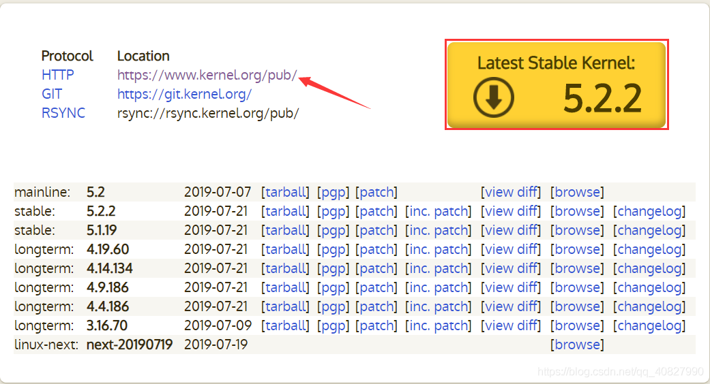

## 查找内核版本
查看当前 bzImage 所对应的内核版本，

\$ strings bzImage \| grep "gcc"*\# 或者 \`file bzImage\` 命令*

4.4.72 (atum[@ubuntu](https://github.com/ubuntu)) (gcc version 5.4.0 20160609 (Ubuntu 5.4.0-6ubuntu1\~16.04.4) ) *\#1 SMP Thu Jun 15 19:52:50 PDT 2017*

\# 下载该版本的内核代码（如果有需要，想更细致的研究内核的话）

\$ curl -O -L <https://mirrors.tuna.tsinghua.edu.cn/kernel/v5.x/linux-4.4.72.tar.xz>  
\$ unxz linux-4.4.72.tar.xz  
\$ tar -xf linux-4.4.72.tar

*来自 \<<https://www.anquanke.com/post/id/255883>\>*

## 可能的依赖
sudo apt install git fakeroot build-essential ncurses-dev xz-utils libssl-dev bc libelf-dev flex bison
## 软件源下载 sudo apt search linux-image \| sudo apt download xxx
首先搜索镜像，下面这句话会把源里有的所有镜像都显示出来，可以配合 grep 来查找特定版本的镜像

sudo apt search linux-image

找出镜像后就可以下载，这里以 linux-image-5.8.0-23-generic 为例

sudo apt download linux-image-5.8.0-23-generic

下载下来后解压，在文件夹data/boot/中的以 vmlinux 开头的即为镜像文件

dpkg -X ./xxx.deb extract \#解压
*来自 \<<https://www.cjovi.icu/pwnreview/1318.html>\>*
lowlatency和generic区别：

[Why choose a low latency kernel over a generic or real-time kernel? - Ask Ubuntu](https://askubuntu.com/questions/126664/why-choose-a-low-latency-kernel-over-a-generic-or-real-time-kernel)

[kernel - What exactly is generic version of ubuntu ? how it differes from other versions? - Ask Ubuntu](https://askubuntu.com/questions/401410/what-exactly-is-generic-version-of-ubuntu-how-it-differes-from-other-versions)
**
## 直接编译内核
[Index of /kernel/linux/kernel/ (bjtu.edu.cn)](https://mirror.bjtu.edu.cn/kernel/linux/kernel/)
### 下载内核 <https://www.kernel.org> 
我们可以从 <https://www.kernel.org> 下载想要的内核。根据 <https://www.kernel.org/category/releases.html>， 我们可以知道内核主要有以下几种类别：

Prepatch

Mainline

Stable

Longterm

### 验证内核签名
### 解压
\$ unxz linux-4.4.72.tar.xz  
\$ tar -xf linux-4.4.72.tar
### 配置内核的编译选项 make menuconfig
### 切换gcc版本（如果gcc版本不符合会报错）[用不同版本gcc编译](onenote:知识.one#用不同版本gcc编译&section-id={D3F076F7-022D-4217-B6C5-C4C1FF682253}&page-id={BBF62043-899E-4DA2-985F-E31B6C567506}&end&base-path=https://d.docs.live.net/8d1582069e7b0b95/文档/pwn)
### 编译
### 常见内核文件的介绍
## 用本机镜像 在 /boot 文件夹中即可找到
## 其他架构编译内核
wget <https://mirrors.edge.kernel.org/pub/linux/kernel/v4.x/linux-4.19.27.tar.xz>

mkdir build

tar xJf linux-4.19.27.tar.xz

cd linux-4.19.27

make ARCH=arm64 defconfig O=../build/ CROSS_COMPILE=aarch64-linux-gnu-

\# 如果需要调整配置选项，则使用menuconfig

make ARCH=arm64 menuconfig O=../build/ CROSS_COMPILE=aarch64-linux-gnu-

make ARCH=arm64 Image -j8 O=../build/ CROSS_COMPILE=aarch64-linux-gnu-

*来自 \<<https://chasinglulu.github.io/2019/07/27/%E5%88%A9%E7%94%A8Qemu-4-0%E8%99%9A%E6%8B%9FARM64%E5%AE%9E%E9%AA%8C%E5%B9%B3%E5%8F%B0/>\>*
## 各种架构的linux内核 <https://people.debian.org/~aurel32/qemu/>

[kernel pwn入门之路（一） - X1ng's Blog](https://x1ng.top/2020/12/22/kernel-pwn%E5%85%A5%E9%97%A8%E4%B9%8B%E8%B7%AF-%E4%B8%80/)
linux 内核 初探：运行你代码在内核态
来自 \< <https://xuanxuanblingbling.github.io/ctf/pwn/2021/08/05/kernel/>\>
[linux kernel 爬坑记录 - s3cunda's blog](https://s3cunda.github.io/%E5%AD%A6%E4%B9%A0%E8%AE%B0%E5%BD%95/2018/09/21/linux-kernel-%E7%88%AC%E5%9D%91%E8%AE%B0%E5%BD%95.html)
