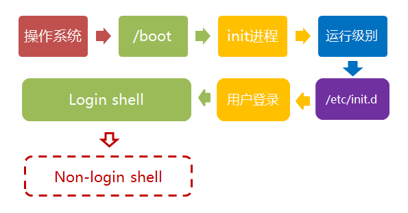
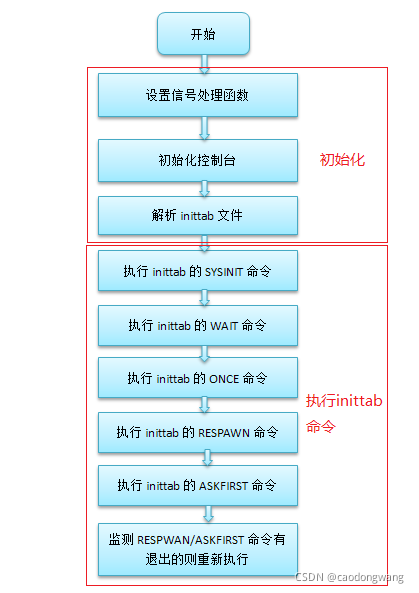

# busybox生成的init进程执行流程
回顾一下启动过程

*来自 \<<https://www.ruanyifeng.com/blog/2013/08/linux_boot_process.html>\>*
**
<https://blog.csdn.net/zz2633105/article/details/120100262>

inittab内容例子：

::sysinit:/etc/init.d/rcS \#执行rcS脚本，完成初始化工作

::respawn:-/bin/sh \#等待sysinit执行完毕后直接进入串口命令行

\# Stuff to do when restarting the init process

::restart:/sbin/init

\#debug for tty1@20151116

\#::respawn:/sbin/getty 38400 tty1

\# Stuff to do before rebooting

::ctrlaltdel:/sbin/reboot

::shutdown:/bin/umount -a -r

::shutdown:/sbin/swapoff -a

所以，我们要做的事很明确，主要为：

1）使用busybox制作init与常用shell命令。

2）创建 /dev/console 和 /dev/null。

3）编写inittab文件，又因为inittab文件会使用到/etc/init.d/rcS脚本，所以还要编辑它，同时又因为/etc/init.d/rcS脚本会使用/etc/fstab配置，所以还要编写它。

4）因为我们要运行gcc（arm架构则是arm-linux-gcc）编译器所编译的程序，所以我们还要将gcc的lib库拷贝到/rootfs/lib下。
# busybox搭建文件系统
## 编译
## 搭建文件系统
**最小根文件系统的组成：**

**1.dev/console /dev/null**

**2.init程序（来源busybox）**

**3./etc/inittab**

**4.配置文件指定的应用程序**

**5.C库**

*来自 \<<https://blog.csdn.net/qq_16933601/article/details/103206897>\>*
**
### 版本一 [新手向———内核调试（上） - 安全客，安全资讯平台 (anquanke.com)](https://www.anquanke.com/post/id/176492)
### 版本二 initramfs [QEMU + Busybox 模拟 Linux 内核环境 - V4ler1an-有毒](https://www.v4ler1an.com/2020/12/qemu/#%E5%88%B6%E4%BD%9Cinitramfs%E6%A0%B9%E6%96%87%E4%BB%B6%E7%B3%BB%E7%BB%9F)
mkdir initramfs

cd initramfs

cp ../\_install/\* -rf ./

mkdir dev proc sys

sudo cp -a /dev/{null, console, tty, tty1, tty2, tty3, tty4} dev/

rm linuxrc

vim init

chmod a+x init

其中init文件的内容如下：

\#!/bin/busybox sh

mount -t proc none /proc

mount -t sysfs none /sys

exec /sbin/init

在创建的initramfs中包含busybox可执行程序、必须的设备文件、启动脚本init，且init只挂载了虚拟文件系统procfs和sysfs，没有挂载磁盘根文件系统，所有操作都在内存中进行，不会落地。

最后打包initramfs：

find . -print0 \| cpio --null -ov --format=newc \| gzip -9 \> ../initramfs.cpio.gz
### 版本三 [(45条消息) Linux kernel Exploit 内核漏洞学习(0)-环境安装_钞sir的博客-CSDN博客_exploit安装](https://blog.csdn.net/qq_40827990/article/details/97036109)
### 版本四 [CTF KETNEL PWN 入门记录 \| p4nda's blog](http://p4nda.top/2018/04/04/kernel-pwn-start/)
首先，在busy-box的根目录下建立_install文件夹，作为文件系统
<table>
<colgroup>
<col style="width: 19%" />
<col style="width: 80%" />
</colgroup>
<thead>
<tr class="header">
<th>
1

2
</th>
<th>
cd _install

mkdir -pv {bin,sbin,etc,proc,sys,usr/{bin,sbin}}
</th>
</tr>
</thead>
<tbody>
</tbody>
</table>
在_install中的etc文件中增加inittab文件，

-------------------This is Content---------------------------

::sysinit:/etc/init.d/rcS

::askfirst:/bin/ash

::ctrlaltdel:/sbin/reboot

::shutdown:/sbin/swapoff -a

::shutdown:/bin/umount -a -r

::restart:/sbin/init

增加etc/init.d/rcS文件 （为啥有两个？）

\#!/bin/sh

\#!/bin/sh

mount -t proc none /proc

mount -t sys none /sys

/bin/mount -n -t sysfs none /sys

/bin/mount -t ramfs none /dev

/sbin/mdev

chmod+x./etc/init.d/rcS

配置dev目录

mkdir dev

sudo mknod dev/ttyAMA0 c 204 64

sudo mknod dev/null c 1 3

sudo mknod dev/console c 5 1

建立完上述文件后，可以制作img镜像了。

在_install文件夹下：

find . \| cpio -o --format=newc \> ../rootfs.img

[(47条消息) 利用qemu-system-aarch64调试Linux内核（arm64）\_Oliverlyn的博客-CSDN博客_qemu-system-aarch64](https://blog.csdn.net/Oliverlyn/article/details/105178832) 自动化脚本 不同版本libc

## 指令解析
### find指令 [Linux find 命令 \| 菜鸟教程 (runoob.com)](https://www.runoob.com/linux/linux-comm-find.html)
-print0

-print是默认操作，有没有都一样

-print0 处理换行符？

[command line - What is the difference between find . and find . -print - Unix & Linux Stack Exchange](https://unix.stackexchange.com/questions/197824/what-is-the-difference-between-find-and-find-print)
### cpio指令 [cpio linux 命令 在线中文手册 (51yip.com)](http://linux.51yip.com/search/cpio)
-0或--null 　接受新增列控制字符，通常配合find指令的"-print0"参数使用。

-o或--create 　执行copy-out模式，建立备份档。

-v或--verbose 　详细显示指令的执行过程。

--format=newc

newc ：新型 (SVR4) 跨平台 格式, 支持 大于 65536 i节点 的 文件系统.
### gizp
-9

-# --fast --best

Regulate the speed of compression using the specified digit \#,

where -1 or --fast indicates the fastest compression method

(less compression) and -9 or --best indicates the slowest com‐

pression method (best compression). The default compression

level is -6 (that is, biased towards high compression at ex‐

pense of speed).

## 解压文件系统
### 不知道为啥没用
rm -rf /tmp/rootfs

mkdir /tmp/rootfs

sudo mount -o loop rootfs.img /tmp/rootfs

mkdir test

sudo cp -rf /tmp/rootfs/\* test

sudo chown user:user test

sudo chmod 777 test -R \#不加权限,压缩会报错

tar -zcvf test.tar.gz test \#打包压缩
### cpio解压
解压cpio文件 cpio -idmv \< filename.cpio

同样可以解压img文件：cpio -idmv \< filename.imgcpio

*来自 \<<https://blog.csdn.net/newhappy2008/article/details/8680398>\>*

### gzip解压
gzip -d filename.gz \#必须要gz结尾
