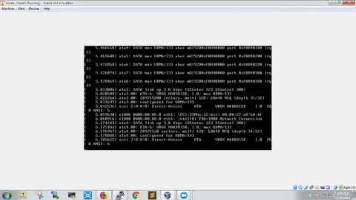
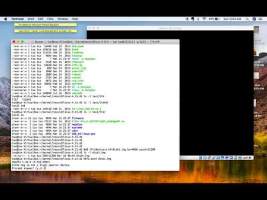

[012 Understanding the Initramfs](https://www.youtube.com/watch?v=fF0sRUW83vQ)

dracut -f
生成initramfs，根据当前文件系统？

[Creating Initrd/InitRamfs and minimal root filesystem for Linux Kernel](https://www.youtube.com/watch?v=S1WsIbxbd_k)

mkinitramfs -o initrd.img
解压img
zcat initrd.img \| cpio -idmv

dd if=/dev/zero of=disk1.img bs=4096 count=51200
mkfs.ext4 disk1.img
mount disk1.img /mnt -t ext4
复制上面initrd.img的内容到mnt中
mkdir /mnt/sys /mnt/proc /mnt/dev
